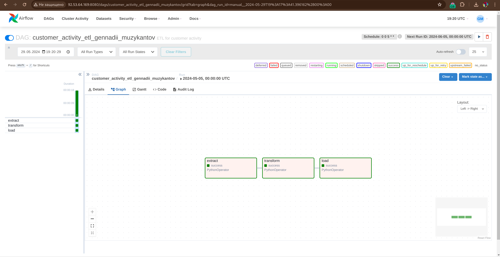
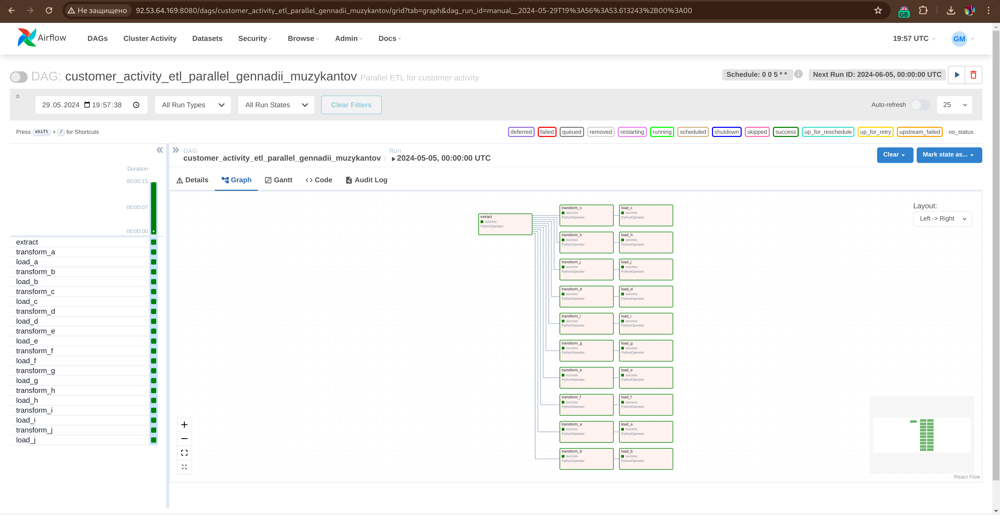

# ETL-процесс активности клиентов с использованием Airflow

Этот репозиторий содержит ETL-процесс, разработанный с использованием Apache Airflow, для расчета флагов активности клиентов на основе данных о транзакциях. Процесс включает извлечение данных из CSV-файла, их преобразование с помощью пользовательского скрипта и загрузку результатов в другой CSV-файл.

## Особенности

- Ежемесячный запуск ETL-процесса 5-го числа каждого месяца.
- Параллельная обработка для различных категорий продуктов.
- Настройка с использованием Docker Compose для простого развертывания.
- Лицензия MIT.

## Структура проекта

- `dags/`
  - `dag_etl.py`: Основной DAG для ETL-процесса.
  - `dag_etl_parallel.py`: DAG для параллельной обработки категорий продуктов.
  - `transform_script.py`: Скрипт, содержащий логику преобразования.
  - `profit_table.csv`: Входной файл данных с информацией о транзакциях.
  - `flags_activity.csv`: Выходной файл с рассчитанными флагами активности.
- `docker-compose.yml`: Конфигурация Docker Compose.
- `.gitignore`: Файл игнорирования Git.
- `LICENSE`: Лицензия MIT.
- `README.md`: Документация проекта.

## Установка

1. Клонируйте репозиторий:
   ```sh
   git clone https://github.com/muzykantov/airflow-etl-pipeline.git
   cd airflow-etl-pipeline
   ```

2. Убедитесь, что Docker и Docker Compose установлены на вашем компьютере.

3. Запустите миграцию базы данных:
   ```
   compose run webserver airflow db migrate
   ```

4. Запустите скрипт создания пользователя, отредактировав пример в файле ```add_user.sh```:
   ```
   chmod +x add_user.sh && ./add_user.sh
   ```

5. Запустите сервисы Airflow:
   ```sh
   docker-compose up -d
   ```

## Использование

1. Поместите ваш входной файл данных (`profit_table.csv`) в директорию `dags/`.

2. Откройте веб-интерфейс Airflow по адресу `http://localhost:8080` и запустите DAG вручную или дождитесь запланированного запуска.

## Скриншоты

### Успешный запуск DAG (одиночный)



### Успешный запуск DAG (параллельный)



## Лицензия

Этот проект лицензирован по лицензии MIT. См. файл [LICENSE](LICENSE) для подробностей.

## Вклад

Если у вас есть улучшения или предложения, не стесняйтесь открывать issues или создавать pull requests.

## Контакты

По любым вопросам обращайтесь к Геннадию Музыкантову по адресу [gennadii@muzykantov.me].